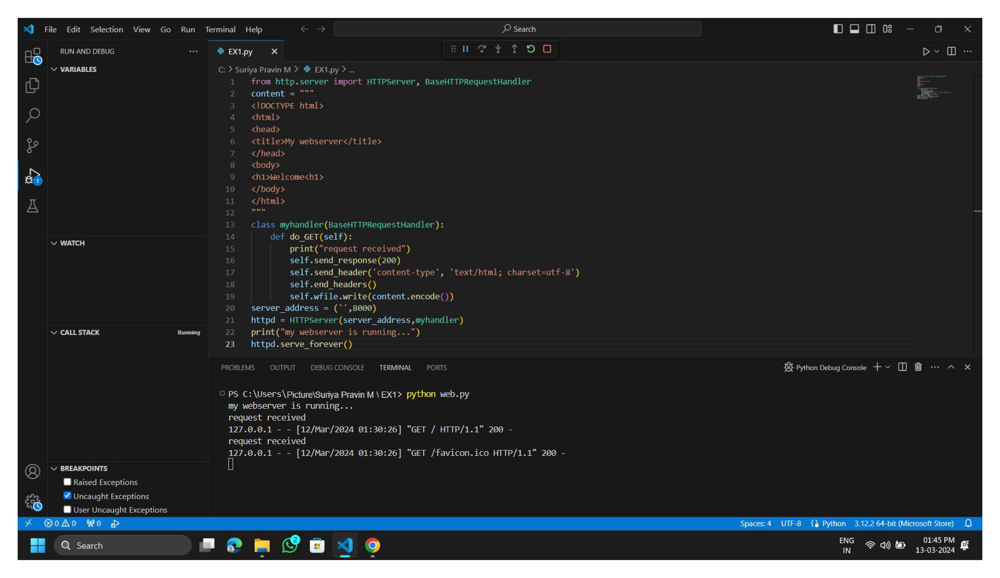

# EX01 Developing a Simple Webserver
## Date: 20-03-2024
## Name: Blessing Jeffrey Y.L
## Roll no: 212223220014
## Dept: IT

## AIM:
To develop a simple webserver to serve html pages.

## DESIGN STEPS:
### Step 1: 
HTML content creation.

### Step 2:
Design of webserver workflow.

### Step 3:
Implementation using Python code.

### Step 4:
Serving the HTML pages.

### Step 5:
Testing the webserver.

## PROGRAM:
```
from http.server import HTTPServer, BaseHTTPRequestHandler
content = """
<!DOCTYPE html>
<html>
<head>
<title>Top 5 Revenue Generating Companies</title>
<style>
    table {
        border-collapse: collapse;
        width: 100%;
    }
    th, td {
        border: 1px solid #dddddd;
        text-align: left;
        padding: 8px;
    }
    th {
        background-color: #f2f2f2;
    }
</style>
</head>
<body>

<h2>Top 5 Revenue Generating Companies</h2>

<table>
  <thead>
    <tr>
      <th>Rank</th>
      <th>Company</th>
      <th>Revenue (in billions)</th>
    </tr>
  </thead>
  <tbody>
    <tr>
      <td>1</td>
      <td>Apple Inc.</td>
      <td>260.174</td>
    </tr>
    <tr>
      <td>2</td>
      <td>Samsung Electronics</td>
      <td>197.705</td>
    </tr>
    <tr>
      <td>3</td>
      <td>Amazon.com Inc.</td>
      <td>386.064</td>
    </tr>
    <tr>
      <td>4</td>
      <td>Alphabet Inc.</td>
      <td>182.527</td>
    </tr>
    <tr>
      <td>5</td>
      <td>Microsoft Corporation</td>
      <td>168.088</td>
    </tr>
  </tbody>
</table>
</body>
</html>

"""
class myhandler(BaseHTTPRequestHandler):
    def do_GET(self):
        print("request received")
        self.send_response(200)
        self.send_header('content-type', 'text/html; charset=utf-8')
        self.end_headers()
        self.wfile.write(content.encode())
server_address = ('',8000)
httpd = HTTPServer(server_address,myhandler)
print("my webserver is running...")
httpd.serve_forever()
```

## OUTPUT:




## RESULT:
The program for implementing simple webserver is executed successfully.